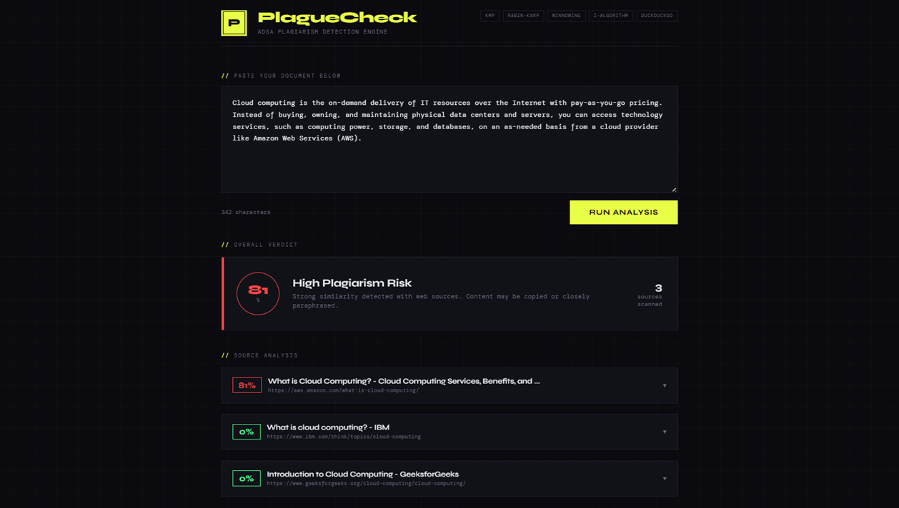
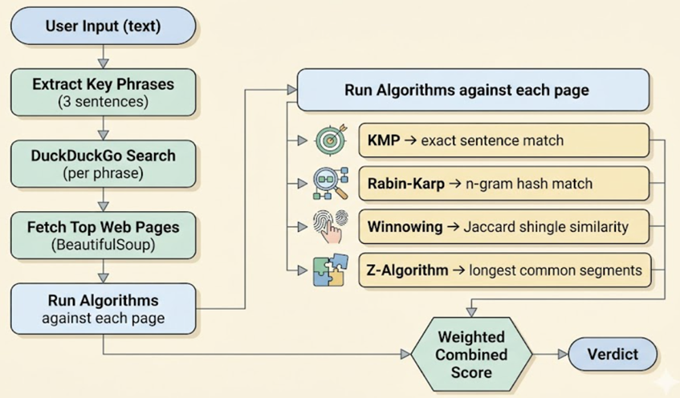

# 🔍 PlagueCheck — ADSA Plagiarism Detection Engine
### Detect Similarity. Uncover Hidden Matches. Think Like an Algorithm.

<p align="center">
  
</p>

<p align="center">
  <b>Multi-Algorithm Plagiarism Detection Engine powered by ADSA concepts</b>
</p>

<p align="center">
  
  
  
  
</p>

---

An ADSA project that detects plagiarism by:
1. Extracting key phrases from your document
2. Searching the web via DuckDuckGo (no API key needed)
3. Fetching and parsing top result pages
4. Running 4 string-matching algorithms against each source

---

## Demo

<p align="center">
  
</p>

---

## Algorithms Implemented (from scratch)

| Algorithm | Purpose | Time Complexity |
|---|---|---|
| **KMP (Knuth-Morris-Pratt)** | Exact sentence matching | O(n + m) |
| **Rabin-Karp** (rolling hash) | N-gram fingerprint matching | O(n + mk) avg |
| **Winnowing / Shingling** | Fuzzy/paraphrase detection (Jaccard) | O(n) |
| **Z-Algorithm** | Longest common segment detection | O(n) |

Combined weighted score = 35% KMP + 30% RK + 20% Winnowing + 15% Z-Algo

---

## Setup & Run

```bash
# 1. Install dependencies
pip install -r requirements.txt

# 2. Start the Flask server
python app.py

# 3. Open in browser
# http://localhost:5000
```

---

## How It Works (Flow)

<p align="center">
  
</p>

---

## Verdict Thresholds

| Score | Verdict |
|---|---|
| 0–10% | ✅ Clean |
| 10–30% | 🔵 Low Similarity |
| 30–60% | 🟡 Moderate |
| 60%+ | 🔴 High Plagiarism Risk |

---

## Notes

- DuckDuckGo is scraped via HTML endpoint (no API key required)
- Polite 0.5–1.2s delay between requests to avoid rate limiting
- All algorithms written from scratch — no string library shortcuts

## Author

**Laavanya Kushwaha**  
Web Development | AI | Machine Learning  

---

## ⭐ Support

If you like this project:

- Star the repo  
- Fork it  
- Share it  

---

<p align="center">
  
</p>
